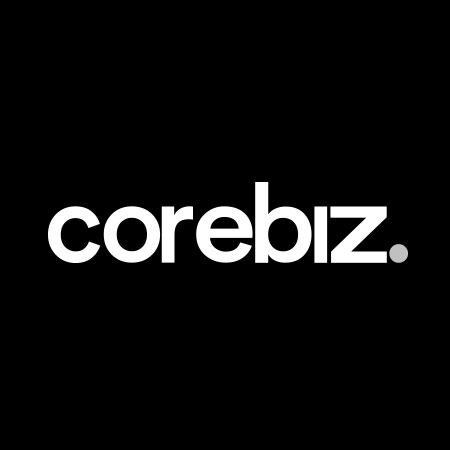
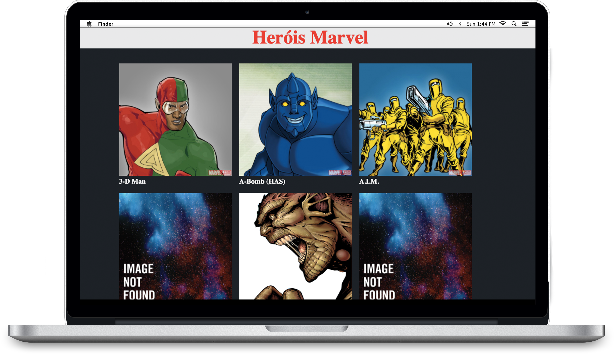

<h1 align="center">
    
</h1>

  <a href="#-tecnologias">Tecnologias</a>&nbsp;&nbsp;&nbsp;|&nbsp;&nbsp;&nbsp;
  <a href="#-projeto">Projeto</a>&nbsp;&nbsp;&nbsp;|&nbsp;&nbsp;&nbsp;
  <a href="#-layout">Layout</a>&nbsp;&nbsp;&nbsp;|&nbsp;&nbsp;&nbsp;
  <a href="#memo-licença">Licença</a>

  
 

 

##  Tecnologias

Esse projeto foi desenvolvido utilizando as seguintes tecnologias:

- [Java Script](https://www.javascript.com)
- [jQuery](https://jquery.com)
- [HTML5](https://www.w3schools.com/html/)
- [CSS3](https://www.w3schools.com/css/)

##  Projeto

1.Criar uma API da Marvel em jQuery.  
2.Criar uma API da Marvel em Java Script puro.

Projeto responsavél pela <a href="https://www.corebiz.ag/en/" target="_blank">Corebiz</a> desenvolvido no dia 13/01/2021 durante a edição do <a href="https://conteudo.corebiz.ag/gobeyond" target="_blank">GoBeyond</a>.
Aula ministrada pelo **[@Eugenio do Rosario](https://github.com/MrRosario)**.

 
##  Layout

 

##   Licença

Esse projeto está sob a licença MIT. Veja o arquivo [LICENSE](LICENSE.md) para mais detalhes.

---

Desenvolvido por Erik Ieto

